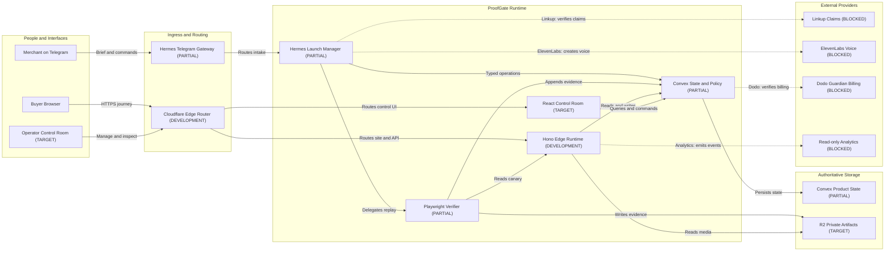
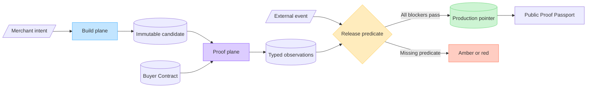
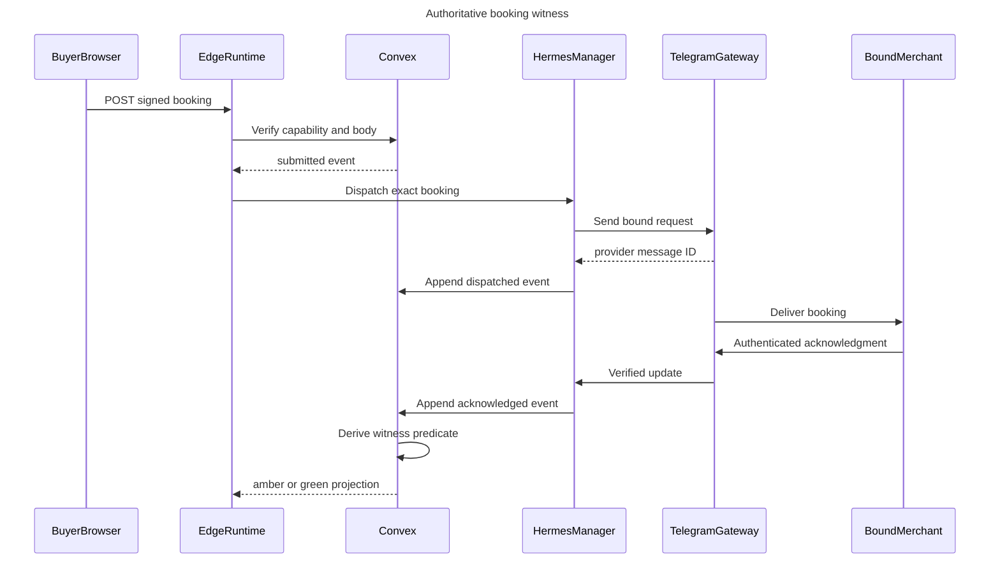
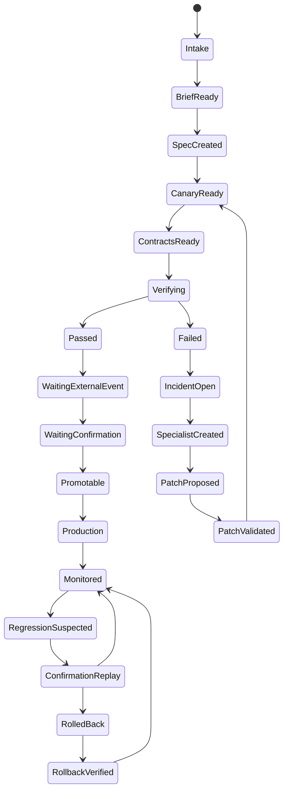

# ProofGate system architecture

> The approved WhatsApp home-bakery P0 and current as-built boundaries are summarized in [architecture.md](architecture.md). Where this historical general architecture discusses Telegram booking or payments, the 2026-08-06 Build Bible amendment governs the implemented P0.

> The launch agency that cannot approve its own work.
>
> This document explains the target production design and the current implementation truth. [PROOFGATE_BUILD_BIBLE.md](../PROOFGATE_BUILD_BIBLE.md) remains the product authority; [EVIDENCE.md](../EVIDENCE.md) remains the authority for what has actually been proven.

## 1. ProofGate in one minute

ProofGate turns a merchant conversation into a transactional site, compiles the buyer's intended outcome into an executable contract, and refuses to release the site until independent evidence proves the contract.

Three rules make it different from an AI website prompt:

1. **Agents may propose data, not executable page code.** A builder can only create or patch a Zod-validated `SiteSpec`.
2. **The builder cannot certify itself.** A capability-isolated Playwright runner replays the Buyer Contract against an immutable public canary.
3. **Green is computed, never assigned.** Deterministic release policy requires matching browser evidence, authoritative external events, confirmations, approvals, and an exact version hash.

After release, the same contracts become guardian probes. A confirmed regression can revoke the public Proof Passport and atomically roll production back to the last certified version.

## 2. Status legend

| Label | Meaning |
|---|---|
| **BUILT** | Implemented and locally verified in the repository |
| **DEVELOPMENT** | Real development infrastructure exists, but it is temporary or not final judging evidence |
| **PARTIAL** | Some code exists; the end-to-end contract is not complete |
| **TARGET** | Required by the production design and Build Bible, but not implemented yet |
| **BLOCKED** | Requires a credential, consent, provider state, or external-human action |

## 3. System architecture



### Deployable boundaries

| Boundary | Responsibility | Authority | Current state |
|---|---|---|---|
| Hermes Telegram gateway | Receives merchant intake and sends approved messages/audio | Messaging only; a send receipt proves dispatch, not acknowledgment | PARTIAL |
| Hermes Launch Manager | Plans missions, invokes typed operations, delegates restricted roles | Coordinates side effects; cannot set release or passport state | PARTIAL |
| Cloudflare Hono runtime | Serves sites, previews, proof pages and signed edge endpoints | Public HTTP boundary; no model execution or arbitrary browser automation | DEVELOPMENT |
| Convex backend | Stores authoritative state and derives event, run and release predicates | Only deterministic mutations may change pointers or derived state | PARTIAL |
| Node/Playwright verifier | Executes validated Buyer Contracts in fresh browser contexts | Append-only evidence capability; no build, deploy, provider or promotion credentials | PARTIAL |
| Control room | Shows missions, traces, evidence, cost, diffs and safe operator controls | Site-scoped commands; judge mode is read-only | TARGET |
| R2 artifact store | Holds private screenshots, audio and redacted evidence artifacts | Object storage only; hashes and metadata remain in Convex | TARGET |

## 4. Three-plane trust model

ProofGate is intentionally split into three planes.

| Plane | Produces | Cannot do |
|---|---|---|
| **Build plane** | Briefs, claims, `SiteSpec`, Buyer Contracts and allowlisted JSON Patch proposals | Submit verification evidence or promote production |
| **Proof plane** | Browser observations, screenshots, provider receipts and exact assertion results | Change the site, deploy code, contact customers or choose pass/fail globally |
| **Release plane** | Deterministic predicate evaluation, pointer changes, rollback and passport projection | Generate content, repair a site or reinterpret evidence with an LLM |



The missing arrow is the point: the builder has no route to evidence, production pointers or passport color.

## 5. End-to-end launch pipeline

```mermaid
flowchart LR
    subgraph intake ["1. Understand and Build"]
        brief[/Telegram text, photos and voice/]
        compileBrief[Compile structured brief]
        claimGate{Claims allowed?}
        createSpec[Create validated SiteSpec]
        canary[Publish immutable canary]
    end

    subgraph proof ["2. Compile and Prove"]
        compileContract[Compile Buyer Contract]
        replay[Independent browser replay]
        replayResult{Every blocker passes?}
        waitExternal[Passport amber]
    end

    subgraph repair ["3. Bounded Repair"]
        captureFailure[Append exact failure]
        openIncident[Open incident and eval]
        specialist[Create scoped specialist]
        proposePatch[Propose allowlisted patch]
        newVersion[Validate and hash version]
    end

    subgraph release ["4. Witness, Release and Guard"]
        witness{Authoritative event?}
        voiceRequired{Voice required?}
        voiceReceipt[Generate and dispatch voice]
        releaseGate{Deterministic release gate}
        production[Swap production pointer]
        passport[Publish green passport]
        guardian[Schedule guardian replay]
    end

    brief --> compileBrief --> claimGate
    claimGate -->|"Allowed"| createSpec --> canary --> compileContract --> replay --> replayResult
    claimGate -->|"Unsupported"| compileBrief
    replayResult -->|"No"| captureFailure --> openIncident --> specialist --> proposePatch --> newVersion --> replay
    replayResult -->|"Yes"| witness
    witness -->|"Not yet"| waitExternal
    waitExternal -.->|"New verified event"| witness
    witness -->|"Matched"| voiceRequired
    voiceRequired -->|"Yes"| voiceReceipt --> releaseGate
    voiceRequired -->|"No"| releaseGate
    releaseGate -->|"Promotable"| production --> passport --> guardian
    releaseGate -->|"Blocked"| waitExternal

    style intake fill:#C2E5FF,stroke:#3DADFF
    style proof fill:#DCCCFF,stroke:#874FFF
    style repair fill:#FFCDC2,stroke:#FF7556
    style release fill:#CDF4D3,stroke:#66D575
    style waitExternal fill:#FFECBD,stroke:#FFC943
    style production fill:#CDF4D3,stroke:#66D575
```



### Pipeline invariants

- Every contract, run, event and release is bound to `siteId`, `versionId`, `specHash`, `contractId` and `runId`.
- A failure is never overwritten. It becomes an incident and a versioned eval case.
- A specialist gets one failure family, allowlisted paths and one patch attempt.
- Exact replay uses the same contract against a new immutable version.
- External events are different predicates: submitted, dispatched, acknowledged, payment, fulfillment and confirmation are never interchangeable.
- Promotion is an atomic pointer swap, not a redeploy and not an agent judgment.

## 6. External booking witness pipeline

This is the critical path that prevents a browser-only success screen from being called a real booking.



Required security properties:

- Submission and acknowledgment use different purpose-bound, short-lived, single-use capabilities.
- Buyer session identity and merchant Telegram identity are separate fields.
- The submission hash covers a canonical validated body, not merely an issued token.
- The dispatch event stores the actual provider message ID and canonical recipient identity.
- `external_human` requires a previously bound non-team identity or provider-verified purchaser.
- An acknowledgment must come from an authenticated Telegram callback/reply matching the stored chat, message and update binding.
- Raw capabilities never enter public URLs, HTML, logs or evidence artifacts.

**Current gap:** the development spike still exposes a bearer acknowledgment token through `/ack?token=...`. That route is not authoritative production design and must remain amber until replaced by an authenticated Telegram callback/reply boundary.

## 7. Failure, repair and rollback state machine



The guardian does not create new commercial proof. It checks that already-certified, non-charge pathways remain reachable. A reproducible blocker targets the current production version, turns the passport red and swaps the production pointer to the last certified version.

## 8. Deterministic release authority

The release authority is ordinary policy code, never an agent:

```text
canPromote(candidate) =
  canaryPointerMatches(candidate.versionId, candidate.specHash)
  AND everyBlockerHasPassingIndependentRun(candidate.specHash)
  AND noOpenIncidentTargets(candidate.versionId)
  AND requiredClaimsPass(candidate.versionId)
  AND authoritativeExternalWitnessExists(candidate.versionId)
  AND everyRequiredConfirmationExists(candidate.versionId)
  AND everyRequiredApprovalExists(candidate.versionId)
  AND everyAcceptedObservationUsedTheScopedCapabilityForItsExactRun()
```

Output:

- `PROMOTE`: atomically move the production pointer and append a release record.
- `BLOCK`: return the missing predicate; do not mutate the pointer.
- `ROLLBACK`: atomically move to the last certified pointer after a confirmed production regression.

Passport color is a projection:

| State | Derived meaning |
|---|---|
| Gray | No certified production release |
| Amber | Canary proving, witness pending, guardian stale or first transient failure |
| Green | Current production version satisfies every blocker and witness predicate |
| Red | Confirmed blocker regression targets the current production version |

## 9. Authoritative data model

### Immutable or append-only records

| Domain | Records |
|---|---|
| Merchant context | merchants, customers, consents, contactLinks, briefs, mediaAssets |
| Site lifecycle | sites, siteVersions, releases, proofPassports, guardianSchedules |
| Executable proof | buyerContracts, contractRuns, runSteps, evidenceArtifacts, evalCases |
| Recovery | incidents, runtimeRoles, structured patches, approvals |
| External truth | externalEvents, messages, voiceConfirmations, witnessSessions |
| Agency and observability | missions, agentJobs, traceSpans, alerts, promptVersions, templateVersions |

### Mutable state is deliberately tiny

- `site.canaryVersionId`
- `site.productionVersionId`
- `site.previousCertifiedVersionId`
- job leases and heartbeats
- consent revocation and retention timestamps

Everything else is immutable, append-only or derived. This makes a judge-visible history possible and prevents a successful retry from erasing the failure that caused it.

### Current development schema

The present Convex spike implements only:

- `bookingSessions`
- `externalEvents`
- `passportSubjects`

The remaining production tables are TARGET work. The current development schema must not be presented as the final system.

## 10. Buyer Contract and verifier

A Buyer Contract is a restricted program, not a natural-language browser prompt.

```text
Objective: Book exactly two seats and receive the required confirmation
Persona: mobile, en-IN
Steps:
  open ProofGate canary
  assert primary-cta visible
  fill buyer-name
  fill buyer-email
  set quantity to 2
  click primary-cta
  await correlated booking event
Assertions:
  quantity equals 2
  booking submitted
  merchant dispatch exists
  external acknowledgment exists
  voice confirmation dispatched when policy requires it
```

The compiler accepts only known `data-pg` handles and operations. The verifier receives only:

- immutable public canary URL
- validated contract
- non-secret fixtures
- single-use evidence capability

It receives no Convex admin credential, Cloudflare credential, provider key, patch permission or promotion permission. Server code derives assertion and run status from typed observations; the verifier cannot submit `passed: true`.

## 11. Observability and learning pipeline

```mermaid
flowchart LR
    mission[Mission] --> plan[Request-specific plan]
    plan --> jobs[Agent jobs]
    jobs --> spans[(Trace spans)]
    spans --> evidence[(Evidence artifacts)]
    evidence --> runResult{Run result}
    runResult -->|"Pass"| metrics[Version metrics]
    runResult -->|"Fail"| incident[Incident]
    incident --> evalCase[Auto-created eval]
    evalCase --> laterRuns[Every later canary]
    laterRuns --> metrics
    metrics --> controlRoom[Control room]

    style runResult fill:#FFECBD,stroke:#FFC943
    style incident fill:#FFCDC2,stroke:#FF7556
    style evalCase fill:#DCCCFF,stroke:#874FFF
    style controlRoom fill:#C2E5FF,stroke:#3DADFF
```



Every trace span records parent/child IDs, role, model/prompt/template version, timing, tokens, cost, retries and external receipt references. The control room must show a cross-agent tree, not a flat activity feed.

Learning is executable:

1. A real browser or voice failure creates an incident.
2. The failure automatically creates a versioned eval case.
3. Every later candidate runs the eval.
4. A regression blocks promotion.
5. The dashboard compares the failing and repaired versions with raw denominators.

## 12. Voice pipeline

Voice is product work only when it changes a verifiable state.

1. A verified booking event supplies exact receipt fields.
2. ProofGate generates fresh receipt text from those fields.
3. ElevenLabs creates fresh audio and returns a request ID.
4. The audio hash, duration, cost and private object reference are stored.
5. Hermes sends the voice note to the linked, opted-in buyer.
6. The Telegram provider message ID records dispatch.
7. Release policy checks the voice predicate only when the contract requires it.

Buyer Voice Witness follows a similar pipeline: consented voice reply -> private transcript -> split objective facts from subjective feedback -> machine-verifiable clauses -> contract candidate. Feedback never marks its own contract passed.

## 13. Guardian pipeline

Hermes cron starts with the repository ProofGate skill and an absolute workdir:

1. Query production sites whose guardian is due.
2. Acquire an idempotent lease.
3. Run only the server-derived non-mutating GuardianProfile.
4. On first failure, set amber and replay once.
5. On reproducible failure, open an incident and set red.
6. Deterministically roll back when policy allows.
7. Replay blockers against the restored version.
8. Alert the operator and append the full trace.

Guardian never charges a card, contacts a customer without consent, or manufactures a new external witness.

## 14. Route design

| Route | Purpose | Trust level |
|---|---|---|
| `GET /s/:slug` | Render current production `SiteSpec` | Public |
| `GET /preview/:token` | Render one immutable candidate | Signed, expiring |
| `GET /proof/:slug` | Public Proof Passport | Public, derived data |
| `GET /judge` | Evidence index | Read-only, expiring judge scope |
| `POST /events/:slug/booking` | Validate a signed buyer submission | Short-lived submit capability |
| `POST /events/:slug/lead` | Validate a signed lead submission | P1 |
| `POST /api/evidence` | Append typed verifier observations | One-use evidence capability |
| `POST /webhooks/dodo` | Verify raw signed billing events | Provider signature |
| `POST /edge/events` | Append verified edge events | Edge HMAC |
| `GET /edge/manifest` | Resolve immutable manifest | Server credential |

Public form submission alone is never an external witness. Provider callbacks must verify signatures, deduplicate event IDs and correlate to the exact contract and version.

## 15. Security boundaries

- Merchant text is untrusted data: sanitize it and enforce CSP.
- Agents cannot emit scripts, HTML, selectors, provider URLs or arbitrary code.
- Browser navigation is limited to ProofGate-owned origins and an explicit provider allowlist.
- Raw PII, audio, capabilities and provider payloads stay private; public proof uses hashes and redacted summaries.
- Telegram transactional voice, feedback messaging, research calling and recording are separate consent purposes.
- Every outgoing side effect has an idempotency key and provider receipt.
- Acknowledgment requires an authenticated bound identity; bearer possession alone is insufficient.
- Provider environment and account identity are stored with each event.
- Maximum two repair cycles; everything outside the repair grammar escalates.

## 16. Current implementation truth

Snapshot: 12 July 2026.

| Capability | Status | Truthful description |
|---|---|---|
| Zod booking `SiteSpec` | BUILT | Sanitized manifest with stable `data-pg` handles |
| Deterministic renderer | BUILT | Mobile booking template; currently a development fixture |
| Cloudflare runtime | DEVELOPMENT | Temporary Worker serves `/s`, `/ack`, `/proof` and health routes |
| Spike A browser replay | DEVELOPMENT | Three fresh-browser passes pinned to URL and spec hash; not final evidence |
| Convex Spike B state | PARTIAL | Sessions, submitted/dispatched/acknowledged event model and amber/green projection |
| Signed submission split | PARTIAL | Session issuance no longer creates `submitted`; Convex verifies a signed request first |
| Telegram dispatch | PARTIAL | Real provider receipts exist, but earlier runs predate hardened identity binding |
| External acknowledgment | BLOCKED | Current bearer `/ack` is not provider-authenticated and cannot count as production proof |
| Buyer Contract DSL | TARGET | Current verifier is a hardcoded Spike A journey |
| Incident and structured repair | TARGET | Quantity repair grammar is specified, not implemented end to end |
| Deterministic promotion | TARGET | No production/canary pointer system yet |
| Public Proof Passport | PARTIAL | Current route is truthfully hardcoded gray |
| ElevenLabs confirmation | BLOCKED | Credentials and live receipt absent |
| Linkup claim gate | BLOCKED | Credential and live decision absent |
| Control room and traces | TARGET | Evidence ledger exists; product UI does not |
| Guardian rollback | TARGET | Automation architecture specified; production loop absent |
| Three external runs | BLOCKED | No hardened authoritative acknowledgment has completed |

## 17. The four-minute story

1. A merchant sends a voice brief and photos in Telegram.
2. Hermes shows a request-specific plan and creates a structured canary.
3. A buyer says, "I need two seats and Telegram confirmation."
4. The independent verifier proves the canary fails quantity two.
5. The failure creates an incident, runtime specialist and permanent eval.
6. The specialist proposes one allowlisted `SiteSpec` patch.
7. Exact replay passes on the new immutable version.
8. A real bound merchant acknowledges the exact booking.
9. ElevenLabs generates a fresh voice receipt and Hermes dispatches it.
10. Deterministic policy promotes the version and the Proof Passport turns green.
11. The guardian later detects a controlled regression, turns the passport red, rolls back and re-verifies recovery.

That story demonstrates agency, separation, real output, evaluation, memory, observability and revocable trust in one coherent loop.

## 18. Repository map

| Area | Current location |
|---|---|
| Domain schemas | `packages/domain/src/` |
| Structured renderer | `packages/renderer/src/` |
| Oracle and release policy | `packages/release-policy/src/` |
| Hermes messaging boundary | `packages/hermes-io/src/` |
| Cloudflare runtime | `apps/edge-runtime/src/` |
| Playwright verifier | `apps/verifier-runner/src/` |
| Spike B dispatcher | `apps/spike-b-dispatcher/src/` |
| Convex state/functions | `convex/` |
| ProofGate Hermes skill | `hermes/skills/proofgate/SKILL.md` |
| Tests | `tests/unit/` and `tests/integration/` |
| Evidence ledger | `EVIDENCE.md` |

## 19. Non-negotiable review checklist

Before calling any ProofGate run complete:

- [ ] Exact site, version, hash, contract and run bindings exist.
- [ ] Agent output passed Zod validation.
- [ ] Builder, verifier and release credentials are genuinely separate.
- [ ] Submitted, dispatched, acknowledged, payment, fulfillment and confirmation remain distinct.
- [ ] External actor eligibility is provider-backed and non-team.
- [ ] Failures remain visible after repair.
- [ ] Passport and release state are deterministically derived.
- [ ] Provider receipts contain real IDs and truthful environment labels.
- [ ] Voice is fresh, consent-compatible and tied to a state transition.
- [ ] Public claims describe exactly what the evidence proves.
